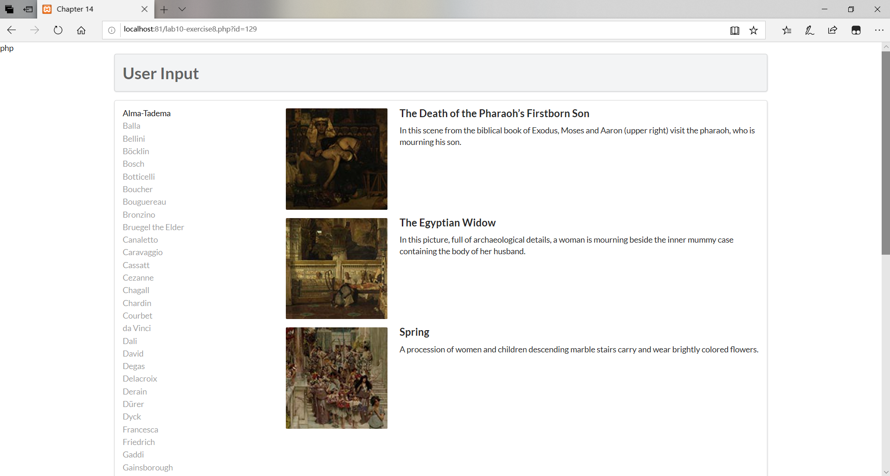

#lab10文档
19302010039 张元昌
##exercise7
+ pdo
     $pdo = new PDO(DBCONNSTRING,DBUSER,DBPASS);  
     $pdo->setAttribute(PDO::ATTR_ERRMODE, PDO::ERRMODE_EXCEPTION);  
     连接数据库，设置错误报告和抛出异常

     $sql = "select * from Artists order by LastName";
     $result = $pdo->query($sql);
     进行查询，并返回结果集

     while ($row = $result->fetch()) {
         echo $row['ArtistID'] . " - " . $row['LastName'] . " "; 
     }
     $pdo = null; 
     获取数据并输出，最后断开连接

+ mysqli
     $connection = mysqli_connect(DBHOST, DBUSER, DBPASS, DBNAME); 
     if ( mysqli_connect_errno() ) {
      die( mysqli_connect_error() ); 
     }
     连接到服务器，获取数据库资源，并检查连接结果
     
     if ($result = mysqli_query($connection, $sql)) {
     // loop through the data
     while($row = mysqli_fetch_assoc($result)) {
        echo '<option value="' . $row['GenreID'] . '">'; 
        echo $row['GenreName'];
        echo "</option>";
     }
     // release the memory used by the result set
     mysqli_free_result($result); 
     }
     mysqli_close($connection);
     设置查询方式，查询成功则进入循环，读取数据，结束循环后释放结果，再断开连接

##exercise8
+ outputArtists()
   连接Artists数据库，获得30行数据，通过while()循环设置好a标签的属性并输出Lastname，其中通过if设置其class。最后释放资源，断开数据库连接。
+ outputPaintings()
   连接Paintings数据库，通过点击获得的id得到数据，通过while循环outputSinglePainting方法输出图片，最后释放资源，断开数据库连接。
+ outputSinglePainting($row)
   通过$row得到url输出照片，标题以及介绍，同时设置好其相应的属性。
   
##exercise9
####使用Statement执行SQL语句
Statement的execute()方法几乎可以执行任何SQL语句，但它执行SQL语句时比较麻烦，通常都是使用executeQuery()方法或者executeUpdate()方法来执行SQL语句；只有不清楚SQL语句的类型，为了保证不出错，最好是用execute()方法来执行该SQL语句。
####使用PreparedStatement执行SQL语句
为Statement的子接口，可预编译SQL 语句，常用于执行多条结构相同，仅值不同的SQL 语句。
####PreparedStatement的优点
+ 预编译SQL语句，性能更好，执行更快。

+ 无须“拼接”SQL 语句，编程更简单。

+ 可以防止SQL 注入（如将输入的true当成直接量，导致判断直接通过，从而降低了安全性），安全性更好。