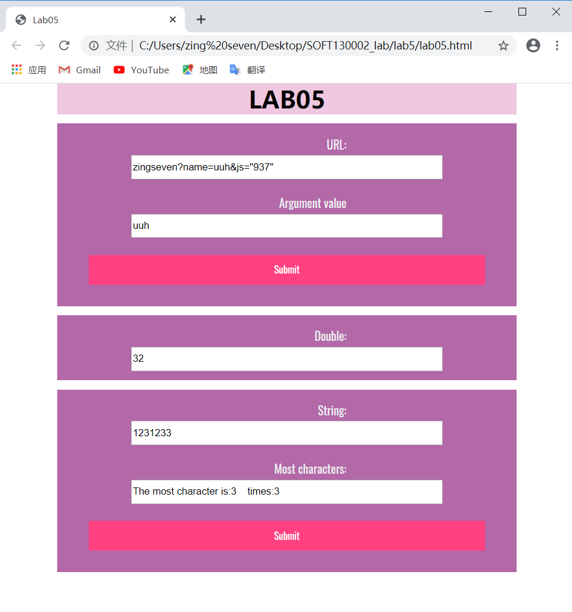

# 设计文档
> 19302010039 张元昌

## 网页运行截图

## URL
利用字符串的**indexOf**方法来获得name的始末位置，再利用**substring**方法来截取URL来获得其中的name字段。

## 时间函数
通过**setInterval**方法来设置间隔执行语句，将方法递归，并且使用**Date**对象来获得当前的分钟，并判断是否停止。**times**用于统计方法次数，10次便停止。

## 最大相同字符个数
利用二维数组储存字符位置和次数，最后通过遍历找出次数最多的字符。